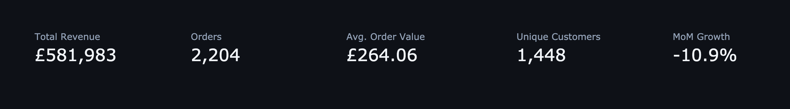
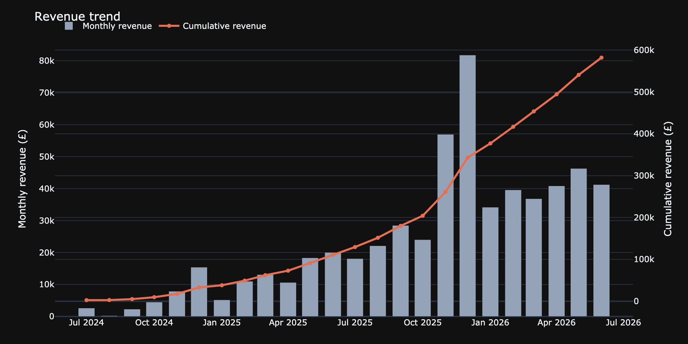
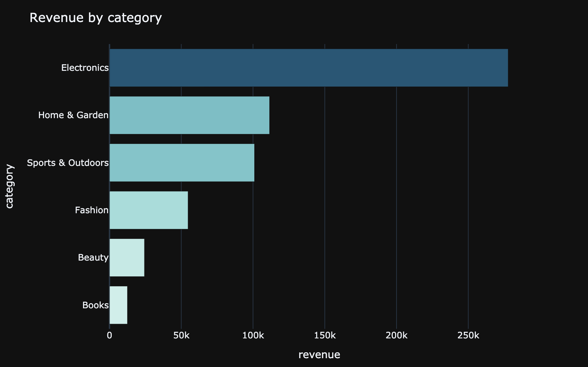
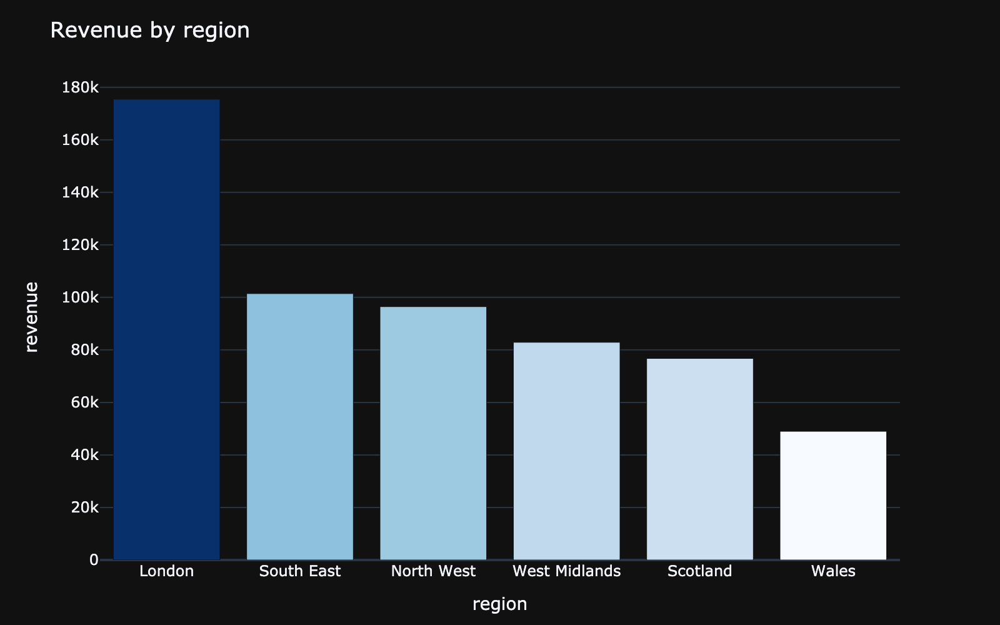
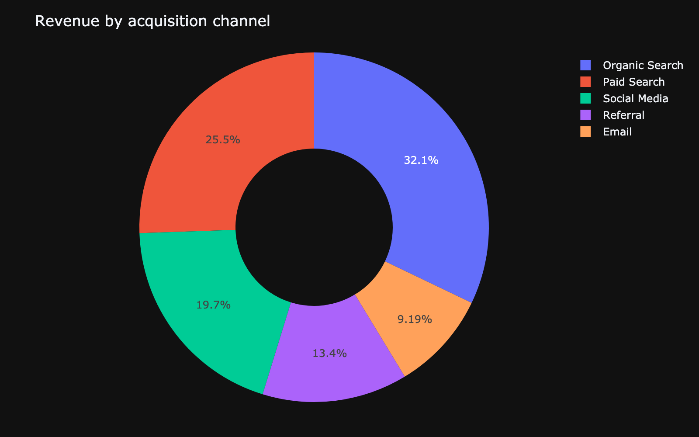
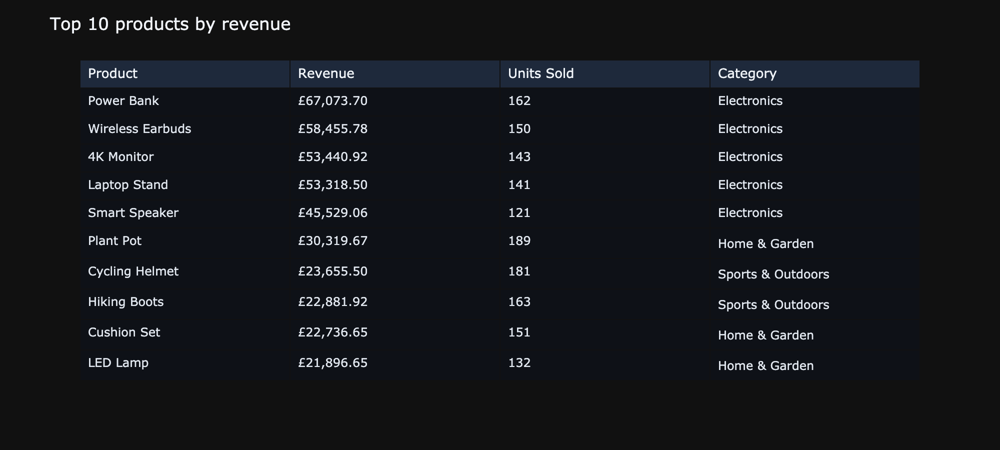

# UK E-Commerce Analytics Dashboard

[](https://www.python.org/)
[](https://streamlit.io/)
[](https://plotly.com/python/)
[](tests/)

An executive-facing, **fully interactive** analytics dashboard — KPI cards,
revenue trend, category/region/channel breakdowns, and a top-products table,
all reactive to sidebar filters (date range, region, category, channel).
Built with Streamlit + Plotly rather than a desktop BI tool so the whole
thing is scriptable, testable, and runnable from a GitHub clone with no
license or desktop install required.

**Dataset:** synthetic but structurally realistic UK e-commerce sales —
3,500 customers, ~2,200 completed orders, July 2024 - June 2026, 6 regions,
6 categories, 5 acquisition channels, with Nov/Dec seasonality and a
tenure-decaying purchase hazard (same generation approach as the sibling
[sql-analytics-case-study](../sql-analytics-case-study) project, applied
here to a single denormalised fact table instead of a relational schema).

---

## Why this project

1. **Interactivity is the point.** Filtering by region/category/channel
   updates every KPI and chart in place — this is what a stakeholder
   actually does with a dashboard, and it's what a static chart export
   can't demonstrate.
2. **KPI logic is separated from the UI** (`src/metrics.py`) and
   independently unit-tested — Streamlit callbacks aren't testable, but the
   numbers they display are, and that's exactly where a silent bug would
   mislead a stakeholder.
3. **No desktop BI license required.** Power BI Desktop is Windows-only and
   Tableau Desktop needs a license; a Streamlit + Plotly dashboard is fully
   open, scriptable, and deployable to Streamlit Community Cloud for free.

---

## Project Structure

```
ecommerce-analytics-dashboard/
├── src/
│   ├── generator.py           # synthetic UK e-commerce sales generator
│   ├── metrics.py              # KPI/aggregation logic (filter, KPIs, top products)
│   ├── app.py                  # the Streamlit app
│   └── export_screenshots.py  # static Plotly exports for this README
├── tests/
│   ├── test_generator.py
│   └── test_metrics.py        # KPI correctness, independent of the UI
├── reports/screenshots/       # static preview images (see below)
├── .streamlit/config.toml     # dark theme config
└── pyproject.toml
```

---

## Preview

**KPI row** — reactive to every filter below it:



**Revenue trend** (monthly + cumulative overlay):



**Revenue by category:**



**Revenue by region and acquisition channel:**




**Top 10 products:**



> These are static exports (`python -m src.export_screenshots`) for
> browsing on GitHub. The live app (`streamlit run src/app.py`) is fully
> interactive — filtering by region, category, date range, or channel
> updates every number and chart above in place. In a live filter test,
> restricting to London alone dropped Total Revenue from £581,983 to
> £175,448 and Orders from 2,204 to 644, with every chart updating
> accordingly.

---

## Quickstart

```bash
# 1. install
pip install -e ".[dev]"

# 2. generate the dataset (optional — the app generates it on first run
#    if data/sales.csv doesn't exist)
python -m src.generator

# 3. run the interactive dashboard
streamlit run src/app.py

# 4. regenerate the static preview images used in this README
python -m src.export_screenshots

# 5. run the tests
pytest tests/ -v
```

### Deploying for free

Push this repo to GitHub, then connect it at
[share.streamlit.io](https://share.streamlit.io) (Streamlit Community
Cloud) pointing at `src/app.py` — no server or license needed, and it gives
a shareable public URL for a CV/LinkedIn link.

---

## Technical Notes

- **Only completed orders count** toward every KPI and chart — the
  dashboard's caption states this explicitly, matching the convention in
  the SQL case study project.
- **`src/metrics.py` is UI-agnostic**: `filter_sales`, `compute_kpis`,
  `revenue_by_period`, `revenue_by_dimension`, and `top_products` take and
  return plain DataFrames, so they're tested directly with `pytest` rather
  than through Streamlit's app-testing harness.
- **Same tenure-decaying purchase hazard as the SQL case study project** —
  each customer's monthly ordering probability decays with months since
  signup (boosted in Nov/Dec) so the revenue trend has genuine growth and
  seasonality structure rather than being uniform noise.
- **`@st.cache_data`** on the data loader avoids regenerating/reloading the
  dataset on every filter interaction.

---

## Portfolio Context

Built for UK data analyst applications, alongside a broader data science
portfolio — this project specifically targets the "interactive dashboard"
artefact that DA job postings and recruiters look for, using an
open/scriptable stack (Streamlit + Plotly) in place of a desktop BI tool
license.
